# 🛒 Quetta Dry Fruits --- E-Commerce Web Application

An e-commerce platform built to bring direct, unadulterated organic dry
fruits from Quetta's historic wholesale markets (Suraj Ganj Bazaar &
Kandahari Bazaar) directly to consumers nationwide.

[](quetta-dry-fruit.vercel.app)
[](https://react.dev/)
[](https://vitejs.dev/)
[](https://tailwindcss.com/)
[](https://nodejs.org/)
[](https://expressjs.com/)
[](https://www.mysql.com/)
[](https://railway.com/)
[](https://vercel.com/)
:::

------------------------------------------------------------------------

## 📚 Table of Contents

-   [📌 Application Overview](#-application-overview)
-   [🎯 Project Goals](#-project-goals)
-   [✨ Key Features](#-key-features)
-   [🖼️ Screenshots & Demos](#️-screenshots--demos)
-   [🛠️ Tech Stack](#️-tech-stack)
-   [🏗️ System Architecture](#️-system-architecture)
-   [🔄 Request Flow](#-request-flow)
-   [📂 Project Structure](#-project-structure)
-   [🚀 Local Development Setup](#-local-development-setup)
-   [🔐 Environment Variables](#-environment-variables)
-   [📡 API Endpoints](#-api-endpoints)
-   [🔄 REST API Design](#-rest-api-design)
-   [☁️ Deployment Configuration](#️-deployment-configuration)
-   [🗄️ Railway MySQL](#️-railway-mysql)
-   [🌐 Live Deployment](#-live-deployment)
-   [🔗 Frontend Integration](#-frontend-integration)
-   [🌍 CORS Configuration](#-cors-configuration)
-   [🔒 Security Considerations](#-security-considerations)
-   [🧪 API Testing](#-api-testing)
-   [📈 Future Improvements](#-future-improvements)
-   [🤝 Contributing](#-contributing)
-   [👨‍💻 Developer Information](#-developer-information)
-   [🎓 Educational Project & License](#-educational-project--license)
-   [⭐ Project Highlights](#-project-highlights)

------------------------------------------------------------------------

## 📌 Application Overview

**Quetta Dry Fruits** bridges primary local growers and wholesale market
merchants with end consumers. It features real-time inventory
management, price calculations per weight, order fulfillment workflows,
administrative financial reporting, and an AI chat assistant widget.

The application is designed as a complete full-stack e-commerce solution
combining a modern React frontend, a Node.js/Express REST API, and a
relational MySQL database.

------------------------------------------------------------------------

## 🎯 Project Goals

The primary goals of this project are to demonstrate practical
implementation of:

-   Full-stack web development
-   Modern frontend development with React
-   Backend API development using Node.js and Express.js
-   RESTful API architecture
-   Relational database integration using MySQL
-   CRUD operations
-   Server-side application development
-   Environment-based configuration
-   Cloud database integration
-   Serverless deployment
-   Frontend-backend communication
-   E-commerce application architecture
-   AI-assisted customer interaction

------------------------------------------------------------------------

## ✨ Key Features

### 🛍️ Client / Storefront

-   **Live Market Rates:** Real-time synchronized pricing fetched
    directly from the MySQL database catalog.
-   **Dynamic Showcase Carousel:** Auto-sliding visual gallery featuring
    organic Balochistan specialties (Chilgoza, Kaghzi Badam, Afghani
    Anjeer, Sunderkhani Kishmish).
-   **Interactive Shopping Cart:** Real-time subtotal, custom quantity
    selections, and itemized local storage management.
-   **Detailed Product View:** In-depth product origins, dietary health
    advantages, and winter weather consumption guides.
-   **AI Chatbot Assistant:** Integrated widget (`ChatBotWidget.jsx`)
    providing automated customer inquiries and recommendations.
-   **Contact & Feedback System:** Form submissions allowing direct
    buyer queries and customer response logging.

### 🔐 Administrative Portal (`/admin/*`)

-   **Secure Authentication:** Protected admin routes utilizing
    `ProtectedRoute.jsx` for access control.
-   **Inventory Management:** CRUD operations for adding, updating live
    market rates per kg, and removing product listings.
-   **Order Processing:** Real-time tracking of incoming customer
    orders, fulfillment status updates, and delivery management.
-   **Profit & Financial Dashboard:** Automated revenue calculations,
    margin analysis, and business analytics.
-   **Customer Feedback Center:** Management panel to view and process
    buyer feedback submissions.

### 🌐 Backend Capabilities

-   RESTful API endpoints
-   Product CRUD operations
-   Customer order management
-   Inventory and stock management
-   MySQL relational database integration
-   JSON request and response format
-   CORS support
-   Cloud database connectivity
-   Vercel serverless deployment

------------------------------------------------------------------------

## 🖼️ Screenshots & Demos

### 🛍️ Client & Storefront Pages

| 🏠 Home Page (`Home.jsx`) | 📦 Product Catalog (`Products.jsx`) |
| :---: | :---: |
| 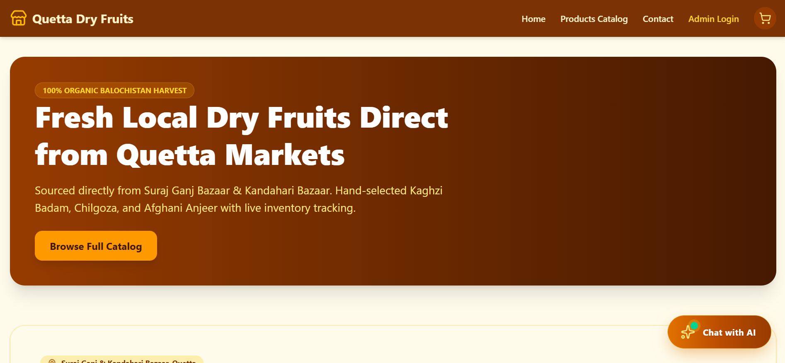 | 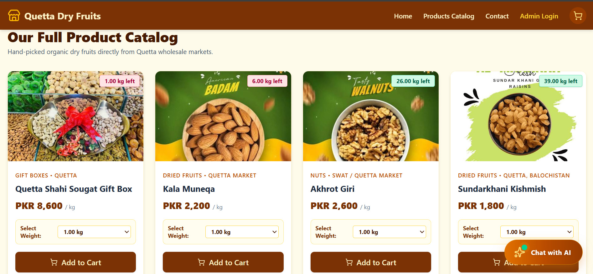 |
| 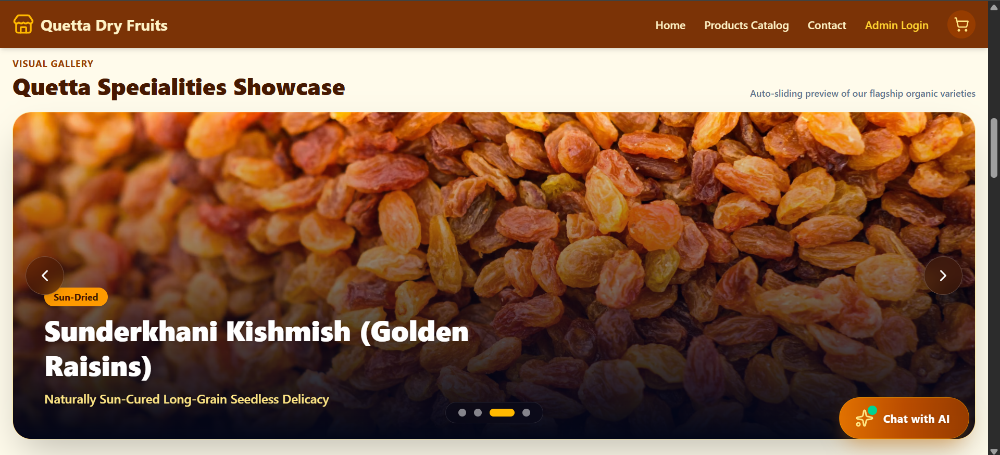 | 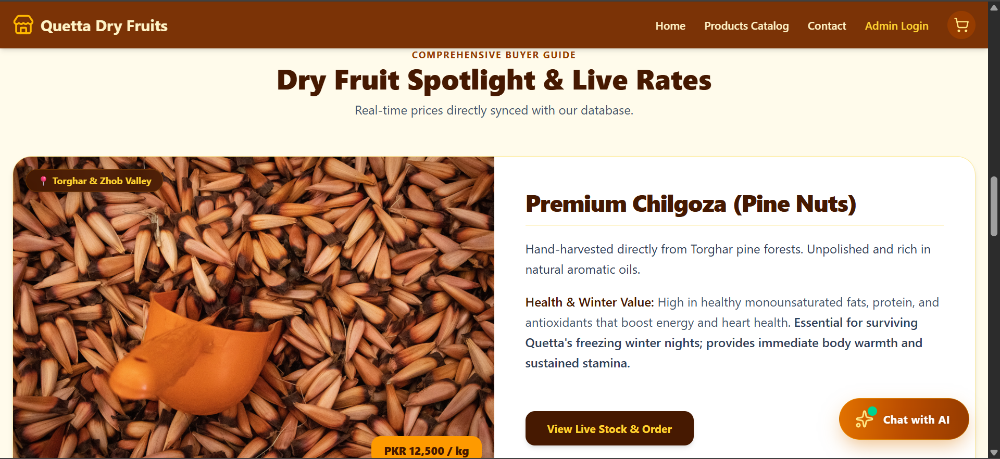 |
| 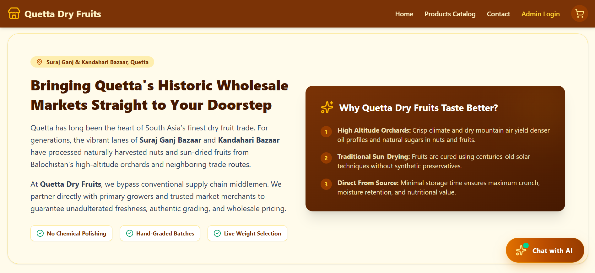 |  |

| 🔍 Product Detail View (`ProductDetail.jsx`) | 🛒 Shopping Cart (`Cart.jsx`) |
| :---: | :---: |
| 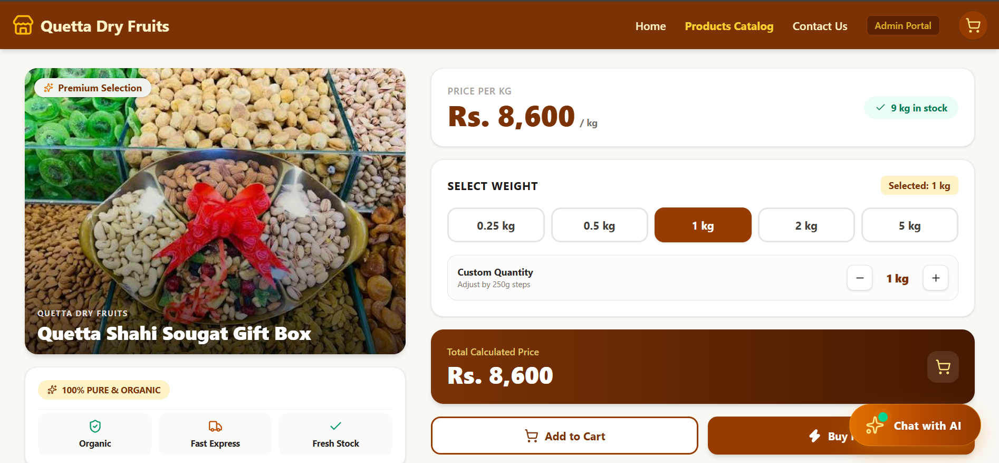 | 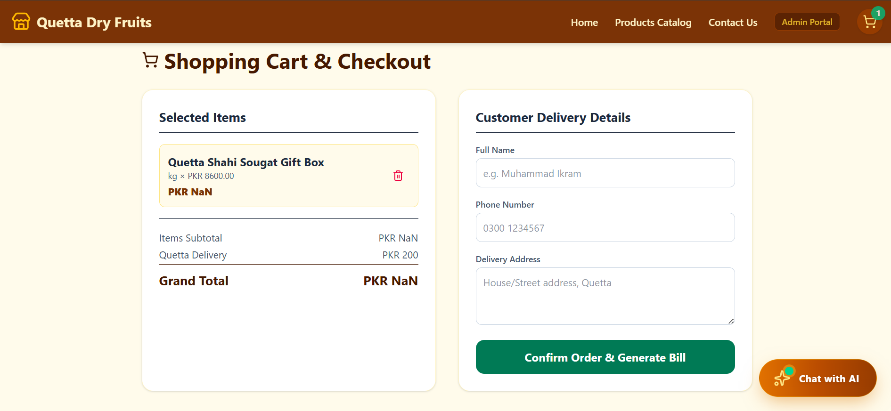 |

| 📞 Contact Page (`Contact.jsx`) | 🤖 AI Chatbot Widget (`ChatBotWidget.jsx`) |
| :---: | :---: |
| 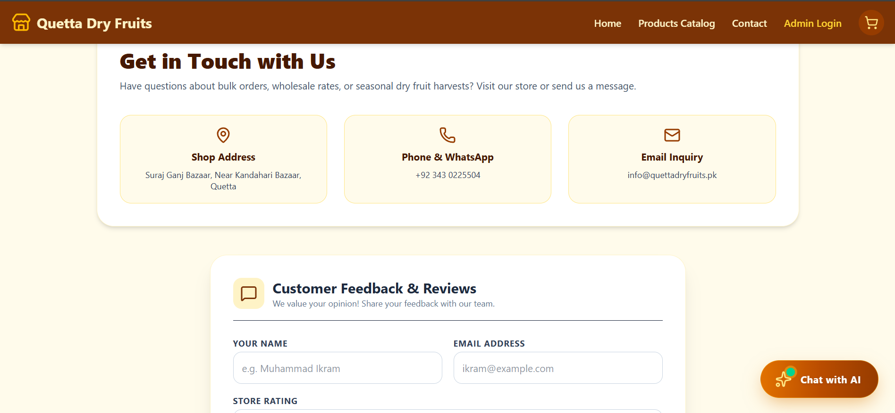 | 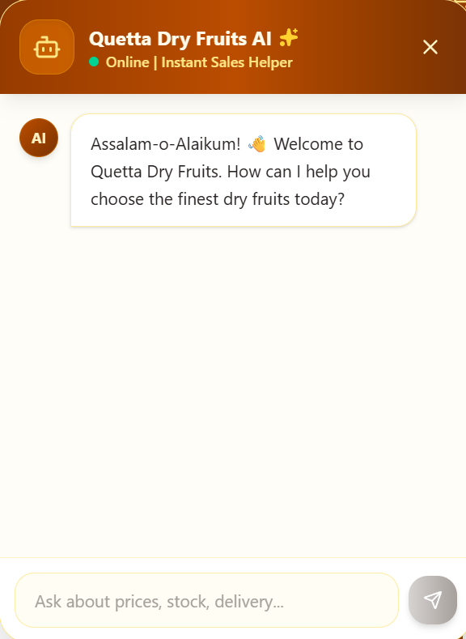 |

---

### 🔐 Administrative Portal (`/admin/*`)

| 🔑 Admin Login (`AdminLogin.jsx`) | 📊 Admin Dashboard (`AdminDashboard.jsx`) |
| :---: | :---: |
| 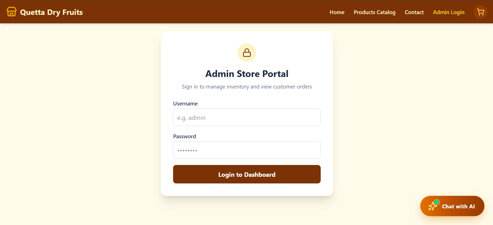 | 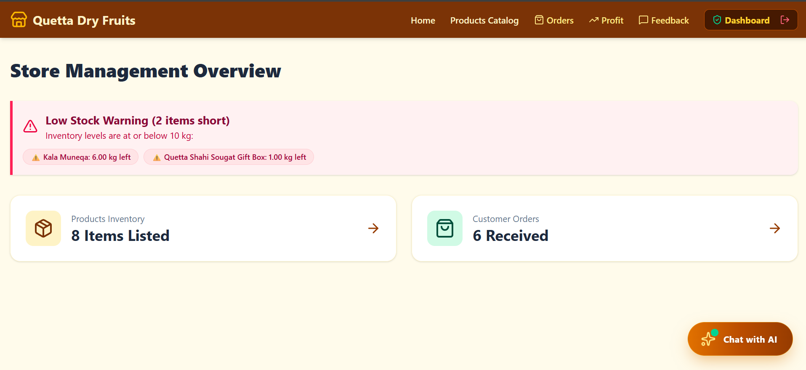 |

| 🏷️ Inventory Management (`AdminProducts.jsx`) | 📦 Order Fulfillment (`AdminOrders.jsx`) |
| :---: | :---: |
| 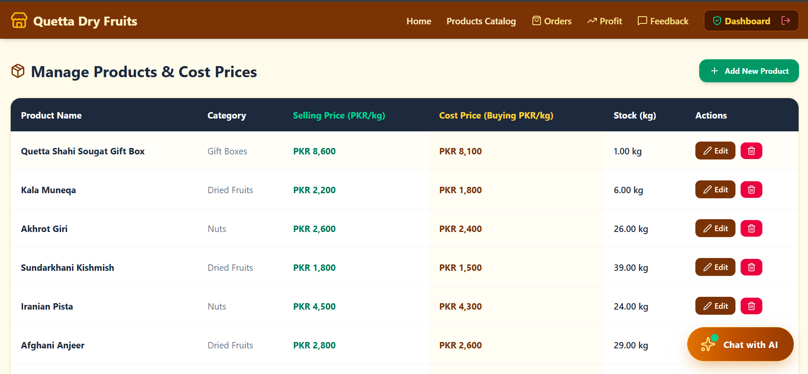 | 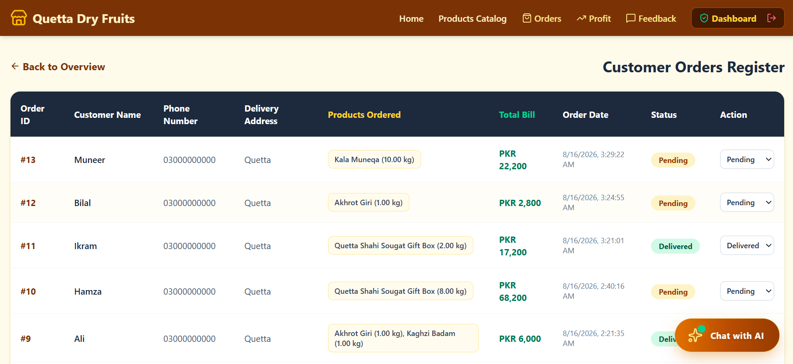 |

| 📈 Profit Analytics (`AdminProfit.jsx`) | 💬 Customer Feedback (`AdminFeedback.jsx`) |
| :---: | :---: |
| 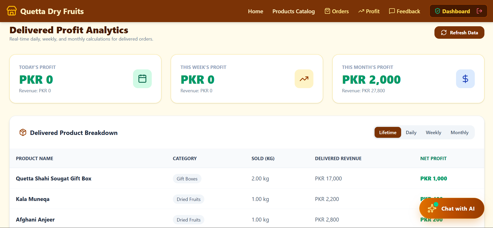 | 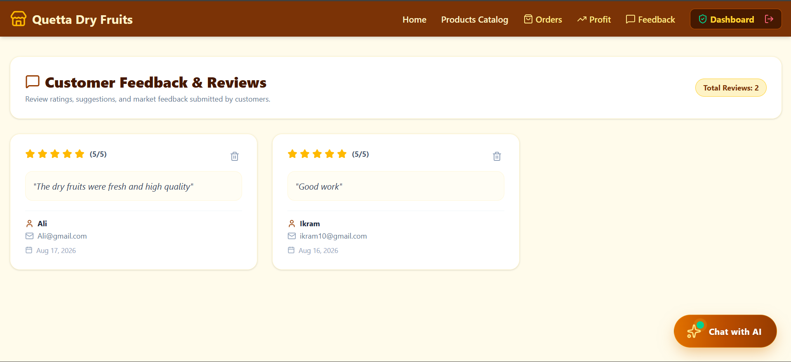 |
> `
------------------------------------------------------------------------

## 🛠️ Tech Stack

### **Frontend Framework & Styling**

  Technology                   Purpose
  ---------------------------- -----------------------
  ⚛️ **React 18**              Frontend library
  ⚡ **Vite**                  Frontend build tool
  🧭 **React Router DOM v6**   Client-side routing
  🎨 **Tailwind CSS**          Responsive UI styling
  🎯 **Lucide React**          Interface icons

### **Backend & Database**

  Technology          Purpose
  ------------------- ---------------------------------
  🟢 **Node.js**      JavaScript runtime
  ⚡ **Express.js**   Backend web framework
  🐬 **MySQL**        Relational SQL database
  🔌 **mysql2**       MySQL database driver
  🌍 **CORS**         Cross-origin API communication
  🔐 **dotenv**       Environment variable management

### **Deployment & Development**

  Technology            Purpose
  --------------------- ---------------------------------------
  🚀 **Vercel**         Frontend & backend deployment
  🚂 **Railway**        Production MySQL database hosting
  🐙 **Git & GitHub**   Version control and source management

------------------------------------------------------------------------

## 🏗️ System Architecture

The application follows a modern full-stack architecture:

``` text
┌─────────────────────────────────────┐
│        Frontend Application         │
│                                     │
│       React + Vite + Tailwind       │
└──────────────────┬──────────────────┘
                   │
                   │ HTTPS / REST API
                   ▼
┌─────────────────────────────────────┐
│              Vercel                 │
│                                     │
│        Express.js Backend           │
│        Serverless Functions         │
└──────────────────┬──────────────────┘
                   │
                   │ MySQL Connection
                   ▼
┌─────────────────────────────────────┐
│             Railway                 │
│                                     │
│          MySQL Database             │
│                                     │
│ Products • Orders • Inventory       │
└─────────────────────────────────────┘
```

------------------------------------------------------------------------

## 🔄 Request Flow

A typical request follows this architecture:

``` text
Client
  │
  ▼
HTTP Request
  │
  ▼
Express.js Route
  │
  ▼
Business Logic
  │
  ▼
MySQL Query
  │
  ▼
Railway MySQL
  │
  ▼
JSON Response
  │
  ▼
Client
```

For example, when the frontend requests products:

``` text
Products.jsx
     ↓
GET /api/products
     ↓
Express.js
     ↓
MySQL Query
     ↓
Railway MySQL
     ↓
Product Data
     ↓
JSON Response
     ↓
React Product Catalog
```

------------------------------------------------------------------------

## 📂 Project Structure

``` text
quetta-dryfruits-frontend/
├── public/
├── src/
│   ├── components/
│   │   ├── ChatBotWidget.jsx     # AI Assistant Widget
│   │   ├── Navbar.jsx            # Dynamic Navigation Bar
│   │   └── ProtectedRoute.jsx    # Admin Access Control Route Guard
│   ├── pages/
│   │   ├── AdminDashboard.jsx    # Overview Control Center
│   │   ├── AdminFeedback.jsx     # Feedback Management Panel
│   │   ├── AdminLogin.jsx        # Admin Authentication
│   │   ├── AdminOrders.jsx       # Order Tracking & Fulfillment
│   │   ├── AdminProducts.jsx     # Product Inventory Management
│   │   ├── AdminProfit.jsx       # Financial Profit Analytics
│   │   ├── Cart.jsx              # Checkout & Cart Management
│   │   ├── Contact.jsx           # User Inquiry & Support Form
│   │   ├── Home.jsx              # Landing Page & Product Spotlight
│   │   ├── ProductDetail.jsx     # Individual Item Deep Dive
│   │   └── Products.jsx          # Complete Product Catalog Grid
│   ├── api.js                    # Axios / Fetch API Service Configuration
│   ├── App.jsx                   # Central Application Router
│   ├── index.css                 # Tailwind & Base Styles
│   └── main.jsx                  # React DOM Entry Point
├── .env.example                  # Environment Variables Template
├── .gitignore                    # Git Exclusion Rules
├── package.json                  # Dependencies & Scripts
├── vercel.json                   # Single Page App Deployment Config
└── vite.config.js                # Vite Bundler Settings
```

------------------------------------------------------------------------

## 🚀 Local Development Setup

Follow these steps to run the frontend application locally.

### 1. Prerequisites

Ensure you have:

-   **Node.js v18.0 or higher**
-   **npm**
-   **Git**
-   **MySQL**

For the database, you can use:

-   Local MySQL
-   XAMPP
-   MySQL Workbench
-   Railway MySQL

### 2. Clone Repository

``` bash
git clone https://github.com/muhammadikram23/Quetta-DryFruit.git
cd Quetta-DryFruit
```

### 3. Install Dependencies

``` bash
npm install
```

### 4. Configure Environment Variables

Create a `.env` file in the root directory and add your backend API
endpoint:

``` env
VITE_API_BASE_URL=https://quetta-dry-fruit-backend.vercel.app
```

### 5. Launch Development Server

``` bash
npm run dev
```

Open your browser and navigate to:

``` text
http://localhost:5173
```

### 6. Build for Production

``` bash
npm run build
```

------------------------------------------------------------------------

## 🔐 Environment Variables

The frontend uses environment variables to communicate with the backend.

``` env
VITE_API_BASE_URL=https://quetta-dry-fruit-backend.vercel.app
```

### Backend Database Variables

The backend uses the following MySQL environment variables:

``` env
PORT=5000

MYSQLHOST=your_database_host
MYSQLPORT=your_database_port
MYSQLUSER=your_database_user
MYSQLPASSWORD=your_database_password
MYSQLDATABASE=your_database_name
```

### Environment Variable Reference

  Variable              Description
  --------------------- --------------------------
  `VITE_API_BASE_URL`   Frontend backend API URL
  `PORT`                Backend server port
  `MYSQLHOST`           MySQL hostname
  `MYSQLPORT`           MySQL port
  `MYSQLUSER`           MySQL username
  `MYSQLPASSWORD`       MySQL password
  `MYSQLDATABASE`       MySQL database name

> ⚠️ Never commit `.env` files or database credentials to GitHub.

------------------------------------------------------------------------

## 📡 API Endpoints

### 🛍️ Products

  Method     Endpoint              Description
  ---------- --------------------- -----------------------------
  `GET`      `/api/products`       Retrieve all products
  `GET`      `/api/products/:id`   Retrieve a specific product
  `POST`     `/api/products`       Create a new product
  `PUT`      `/api/products/:id`   Update an existing product
  `DELETE`   `/api/products/:id`   Delete a product

### Example

``` http
GET /api/products
```

Example response:

``` json
{
  "success": true,
  "products": []
}
```

### 📦 Orders

  Method   Endpoint        Description
  -------- --------------- --------------------------
  `GET`    `/api/orders`   Retrieve customer orders
  `POST`   `/api/orders`   Create a customer order

Example:

``` http
POST /api/orders
Content-Type: application/json
```

``` json
{
  "customerName": "Customer Name",
  "items": [],
  "totalAmount": 5000
}
```

------------------------------------------------------------------------

## 🔄 REST API Design

The backend follows conventional REST principles:

  HTTP Method   Operation
  ------------- ---------------
  `GET`         Retrieve data
  `POST`        Create data
  `PUT`         Update data
  `DELETE`      Delete data

All API responses are designed around **JSON**, making the backend
compatible with modern web and mobile clients.

------------------------------------------------------------------------

## ☁️ Deployment Configuration

This application is configured for deployment on **Vercel**.

### Frontend Deployment

The React frontend is deployed on Vercel.

### Backend Deployment

The Express.js backend is deployed using **Vercel Serverless
Infrastructure**.

A typical backend `vercel.json` configuration is:

``` json
{
  "version": 2,
  "builds": [
    {
      "src": "server.js",
      "use": "@vercel/node"
    }
  ],
  "routes": [
    {
      "src": "/(.*)",
      "dest": "server.js"
    }
  ]
}
```

### Deployment Process

1.  Push the project repository to GitHub.
2.  Import the repository into Vercel.
3.  Configure production environment variables.
4.  Deploy the application.
5.  Test the deployed API endpoints.
6.  Connect the frontend to the production API.

------------------------------------------------------------------------

## 🗄️ Railway MySQL

The production database is hosted on **Railway MySQL**.

Production database credentials are supplied to Vercel through
environment variables:

``` env
MYSQLHOST=your_railway_host
MYSQLPORT=your_railway_port
MYSQLUSER=your_railway_user
MYSQLPASSWORD=your_railway_password
MYSQLDATABASE=your_railway_database
```

### 🔒 Database Security

Actual database credentials should **never** be placed inside the README
or committed to GitHub.

The production architecture is:

``` text
React Frontend
      ↓
Vercel
      ↓
Express.js API
      ↓
MySQL Connection
      ↓
Railway MySQL
```

------------------------------------------------------------------------

## 🌐 Live Deployment

### 🚀 Production Application

**Live Frontend:**

quetta-dry-fruit.vercel.app

### 🚀 Production API

https://quetta-dry-fruit-backend.vercel.app

### Example API Request

``` text
https://quetta-dry-fruit-backend.vercel.app/api/products
```

------------------------------------------------------------------------

## 🔗 Frontend Integration

The backend can be consumed by React, Next.js, or other frontend
applications.

### Example using Fetch API

``` javascript
const response = await fetch(
  "https://quetta-dry-fruit-backend.vercel.app/api/products"
);

const data = await response.json();

console.log(data);
```

This separation allows the frontend and backend to be independently
developed, tested, deployed, and maintained.

------------------------------------------------------------------------

## 🌍 CORS Configuration

The backend supports **Cross-Origin Resource Sharing (CORS)**, allowing
frontend applications hosted on different domains to communicate with
the API.

Basic Express configuration:

``` javascript
const cors = require("cors");

app.use(cors());
```

For a production environment, CORS should preferably be restricted to
trusted frontend domains:

``` javascript
app.use(
  cors({
    origin: "quetta-dry-fruit.vercel.app"
  })
);
```

------------------------------------------------------------------------

## 🔒 Security Considerations

For a production-grade deployment, the following security practices are
recommended:

-   🔐 Keep database credentials in environment variables.
-   🚫 Never expose database credentials to the frontend.
-   🛡️ Validate incoming request data.
-   💉 Use parameterized SQL queries to prevent SQL injection.
-   🌐 Restrict CORS to trusted domains.
-   👤 Implement authentication for administrative operations.
-   🔑 Implement authorization and role-based access control.
-   🔒 Use HTTPS in production.
-   🚦 Implement API rate limiting.
-   📝 Add centralized error handling.
-   📊 Implement logging and monitoring.

------------------------------------------------------------------------

## 🧪 API Testing

The API can be tested using:

-   **Postman**
-   **Insomnia**
-   **Thunder Client**
-   **cURL**
-   Frontend applications

### Example

``` bash
curl https://quetta-dry-fruit-backend.vercel.app/api/products
```

------------------------------------------------------------------------

## 📈 Future Improvements

Potential future enhancements include:

-   🔐 JWT authentication
-   👤 Customer authentication
-   🛡️ Role-based authorization
-   🛒 Shopping cart APIs
-   💳 Payment gateway integration
-   📦 Advanced inventory management
-   📊 Admin dashboard improvements
-   🔍 Product search and filtering
-   📄 API pagination
-   🧾 Order status management
-   📧 Email notifications
-   📚 Swagger / OpenAPI documentation
-   🧪 Automated testing
-   🚦 API rate limiting
-   📊 Production monitoring and logging

------------------------------------------------------------------------

## 🤝 Contributing

Although this is primarily an educational project, contributions,
suggestions, and improvements are welcome.

### 1. Fork the Repository

``` bash
git clone https://github.com/muhammadikram23/Quetta-DryFruit.git
cd Quetta-DryFruit
```

### 2. Create a Feature Branch

``` bash
git checkout -b feature/your-feature
```

### 3. Commit Your Changes

``` bash
git add .
git commit -m "Add your feature"
```

### 4. Push the Branch

``` bash
git push origin feature/your-feature
```

Then open a Pull Request.

------------------------------------------------------------------------

## 👨‍💻 Developer Information

### Muhammad Ikram

**BS Computer Science Student & Full-Stack Web Developer**

I am a Computer Science student and aspiring Full-Stack Web Developer
interested in building practical web applications, RESTful APIs,
database-driven systems, and modern software solutions.

This project represents practical implementation of frontend
development, backend API development, relational database management,
cloud deployment, and full-stack application architecture.

### 🔗 Connect With Me

<p align="center">
  <a href="https://github.com/muhammadikram23">
    
  </a>

  <a href="https://www.linkedin.com/in/muhammadikram23/">
    
  </a>
</p>

### 📌 Project Links

  ------------------------------------------------------------------------------------------------------------------------
  Resource                            Link
  ----------------------------------- ------------------------------------------------------------------------------------
  💻 GitHub Profile                   [Muhammad Ikram](https://github.com/muhammadikram23)

  📦 Frontend Repository              [Quetta Dry Fruits](https://github.com/muhammadikram23/Quetta-DryFruit)

  ⚙️ Backend Repository               [Quetta Dry Fruits
                                      Backend](https://github.com/muhammadikram23/Quetta-DryFruit-Backend)

  🌐 Live Application                 [quetta-dry-fruit.vercel.app](quetta-dry-fruit.vercel.app)

  🚀 Live Backend API                 [quetta-dry-fruit-backend.vercel.app](https://quetta-dry-fruit-backend.vercel.app)

  💼 LinkedIn                         [Muhammad Ikram](www.linkedin.com/in/muhammad-ikram-085823350)
  ------------------------------------------------------------------------------------------------------------------------

------------------------------------------------------------------------

## 🎓 Educational Project & License

This project is an **educational full-stack web development project**
and represents the complete e-commerce application developed as a
practical implementation of modern web development technologies.

It was developed as the **final project for the AI & Web Development
program**, offered through **Balochistan Youth Empowerment --- Digital
Balochistan**, by the **Digital Transformation Awareness Network
(DTAN)**.

The project was created for educational and practical learning purposes,
with the objective of applying concepts and technologies related to:

-   Full-stack web development
-   Frontend development
-   Backend API development
-   RESTful architecture
-   Relational database management using MySQL
-   CRUD operations
-   Cloud deployment
-   Web application architecture
-   AI & modern digital technologies

### 🎓 Final Project

**Program:** AI & Web Development\
**Project:** Quetta Dry Fruits --- E-Commerce Web Application\
**Project Type:** Final Course Project\
**Organization:** Balochistan Youth Empowerment --- Digital Balochistan\
**By:** Digital Transformation Awareness Network (DTAN)

### 📄 License

This project is licensed under the **MIT License**.

The MIT License permits the use, modification, and distribution of this
project subject to the terms and conditions defined in the `LICENSE`
file.

**Educational Project --- AI & Web Development Final Project**

**Balochistan Youth Empowerment --- Digital Balochistan**

**Digital Transformation Awareness Network (DTAN)**

------------------------------------------------------------------------

## ⭐ Project Highlights

``` text
             🛒 QUETTA DRY FRUITS
                     │
       ┌─────────────┴─────────────┐
       │                           │
       ▼                           ▼
 React Frontend              RESTful Backend
       │                           │
       │                           ▼
       │                    Node.js + Express
       │                           │
       │                           ▼
       │                         MySQL
       │                           │
       │                           ▼
       │                    Railway Database
       │
       ▼
     Vercel
       │
       ▼
Production E-Commerce Application
```

  Category                Implementation
  ----------------------- ---------------------------------
  🛒 Application          E-Commerce Web Application
  🎨 Frontend             React + Vite + Tailwind CSS
  🧭 Routing              React Router DOM
  ⚡ Backend              Node.js + Express.js
  🔗 API                  RESTful API
  🗄️ Database             MySQL / SQL
  🔌 Database Driver      mysql2
  ☁️ Backend Deployment   Vercel
  🚂 Database Hosting     Railway MySQL
  🤖 AI                   AI Chat Assistant
  🔐 Admin                Protected Administrative Portal
  📊 Analytics            Profit & Financial Dashboard
  📦 Orders               Customer Order Management
  🌐 CORS                 Cross-Origin API Communication
  🐙 Version Control      Git & GitHub

------------------------------------------------------------------------

## 🌟 Why This Project?

**Quetta Dry Fruits** demonstrates the development of a complete
full-stack e-commerce application, combining a modern frontend, RESTful
backend services, relational SQL database, administrative functionality,
AI-assisted customer interaction, and cloud deployment.

The project demonstrates practical experience in taking an application
through the complete development lifecycle:

``` text
Planning
   ↓
Frontend Development
   ↓
Backend API Development
   ↓
MySQL Database Integration
   ↓
Frontend ↔ Backend Integration
   ↓
Testing
   ↓
Cloud Deployment
   ↓
Production Application
```

------------------------------------------------------------------------

## ⚠️ Disclaimer & Image Copyright Notice

All product images and visual assets used in this application were retrieved from Google Search and public domain web sources for **educational and portfolio demonstration purposes only**.

* **Copyright Ownership:** All image rights, trademarks, and copyrights belong entirely to their respective owners and original creators.
* **Non-Commercial Use:** This project is strictly non-commercial and is built solely as an educational project to demonstrate full-stack web development capabilities.
* **No Selling:** None of the images or media assets are being used for commercial sales, monetization, or profit generation.

*If you are the copyright holder of any media used in this project and would like it removed or attributed differently, please feel free to open an issue or reach out directly, and it will be updated immediately.*

------------------------------------------------------------------------


## 🛒 Quetta Dry Fruits

### From Quetta's markets to your doorstep. 🌰

⭐ **If you find this project useful, consider giving the repository a
star!**
